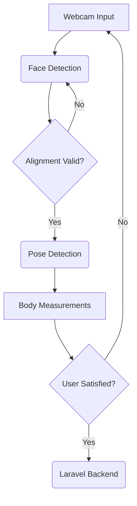
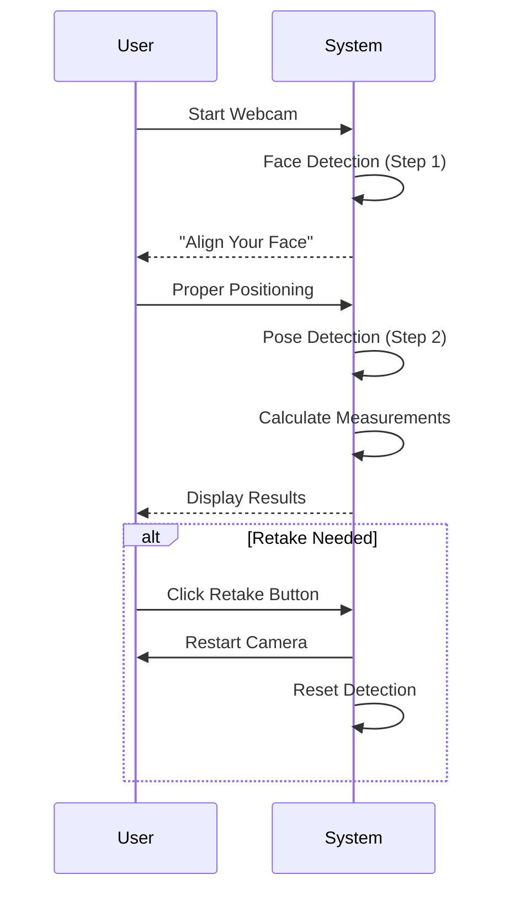
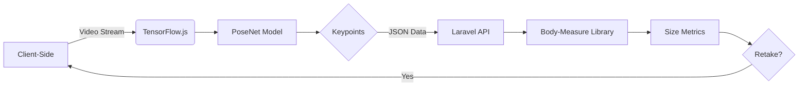

# Sizely AI Detects Sizes POS 

[](https://laravel.com) [](https://www.php.net/)  

[](https://nodejs.org/) [](https://www.tensorflow.org/) [](https://github.com/tensorflow/tfjs-models/tree/master/posenet)  

## Overview

**Sizely AI Detects Sizes POS** is a web application that combines face detection and pose estimation to calculate body measurements. The two-step AI workflow ensures accurate sizing by first aligning the user via face detection, then analyzing body posture with PoseNet. Includes a **retake button** for users to restart the camera if capture quality is unsatisfactory.

---

## Architecture Overview



---

## Key Features

### Two-Step Detection Workflow



1. **Face Detection**  
   Ensures user is centered and at optimal distance from the camera.
2. **Pose Detection**  
   Uses PoseNet to detect 17 body keypoints for measurement extraction.
3. **Retake Functionality**  
   Users can restart the camera and recapture data at any stage using the retake button.

---

## Prerequisites


- Web browser with **WebGL support** (Chrome/Firefox recommended)
- Modern GPU (for accelerated TensorFlow.js computations)

---

## Installation & Setup

### 1. Clone Repository
```bash
git clone https://github.com/engyahmed7/sizely-app.git
```

### 2. Install Dependencies
```bash
composer install && npm install --legacy-peer-deps
```

### 3. Configure Environment
```bash
cp .env.example .env && php artisan key:generate
```

---

## System Design



---

## Acknowledgements

- **Machine Learning**: [TensorFlow.js](https://www.tensorflow.org/js) | [PoseNet](https://github.com/tensorflow/tfjs-models/tree/master/posenet)
- **Measurement Logic**: [body-measure](https://github.com/AI-Machine-Vision-Lab/body-measure)
- **Backend Framework**: [Laravel](https://laravel.com)

---
## Contributing
We welcome contributions from the community! To contribute, follow these steps:

1. **Fork** the repository.
2. **Create a new branch** following this naming convention: `feature/your-feature-name`.
3. **Make your changes** and ensure your code follows the project’s coding standards.
4. **Write tests** if applicable to ensure new functionality works as expected.
5. **Commit your changes** with a meaningful commit message.
6. **Push to your branch** on your forked repository.
7. **Open a Pull Request** with a clear description of your changes and link any relevant issues.
8. **Wait for a review** and address any feedback provided.

Your contributions help improve Vacation Tracker, and we appreciate your efforts!
